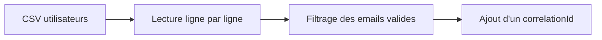
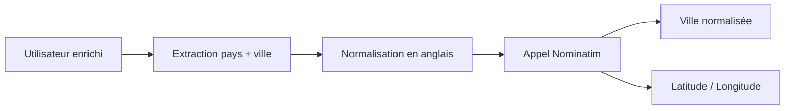
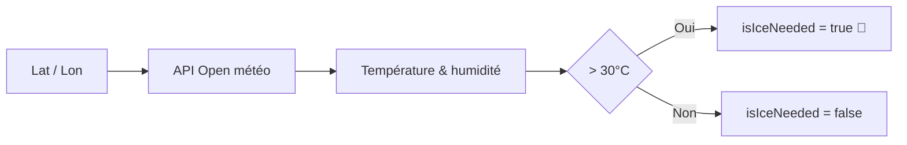

## 1️⃣ Ingestion & nettoyage des données

<v-click>

## 2️⃣ Enrichissement géographique

</v-click>

<v-click>

## 3️⃣ Météo & règle métier

</v-click>

<!--
On part d’un CSV brut, on nettoie, et on sécurise le suivi avec un correlationId.

Ici, on transforme une adresse texte en coordonnées exploitables.

C’est ici que la logique métier s’applique.
-->
