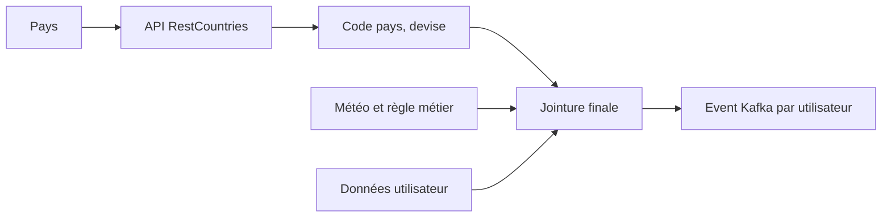

## 4️⃣ Enrichissement pays & diffusion

```mermaid
graph LR
    G[Pays] --> Q[API RestCountries]
    Q --> S[Code pays, devise]

    S --> T[Jointure finale]
    N[Météo et règle métier] --> T
    O[Données utilisateur] --> T

    T --> U[Event Kafka par utilisateur]
```

<!--
On consolide tout et on publie un événement prêt à être consommé.
-->
