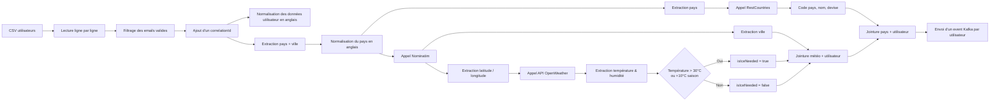

## Schéma complet du flux (en mermaid)

```mermaid
graph LR
    A[CSV utilisateurs] --> B[Lecture ligne par ligne]

    B --> C[Filtrage des emails valides]
    C --> D[Ajout d'un correlationId]

    D --> E[Normalisation des données utilisateur en anglais]

    D --> F[Extraction pays + ville]
    F --> G[Normalisation du pays en anglais]
    G --> H[Appel Nominatim]
    H --> I[Extraction ville]
    H --> J[Extraction latitude / longitude]

    J --> K[Appel API OpenWeather]
    K --> L[Extraction température & humidité]

    L --> M{Température > 30°C\nou +10°C saison}
    M -->|Oui| N[isIceNeeded = true]
    M -->|Non| O[isIceNeeded = false]

    I --> P[Jointure météo + utilisateur]
    N --> P
    O --> P

    G --> Q[Extraction pays]
    Q --> R[Appel RestCountries]
    R --> S[Code pays, nom, devise]

    S --> T[Jointure pays + utilisateur]
    P --> T

    T --> U[Envoi d’un event Kafka par utilisateur]

```

## Ou en EIPs pour avoir un format standardisé :

## Démonstration rapide
